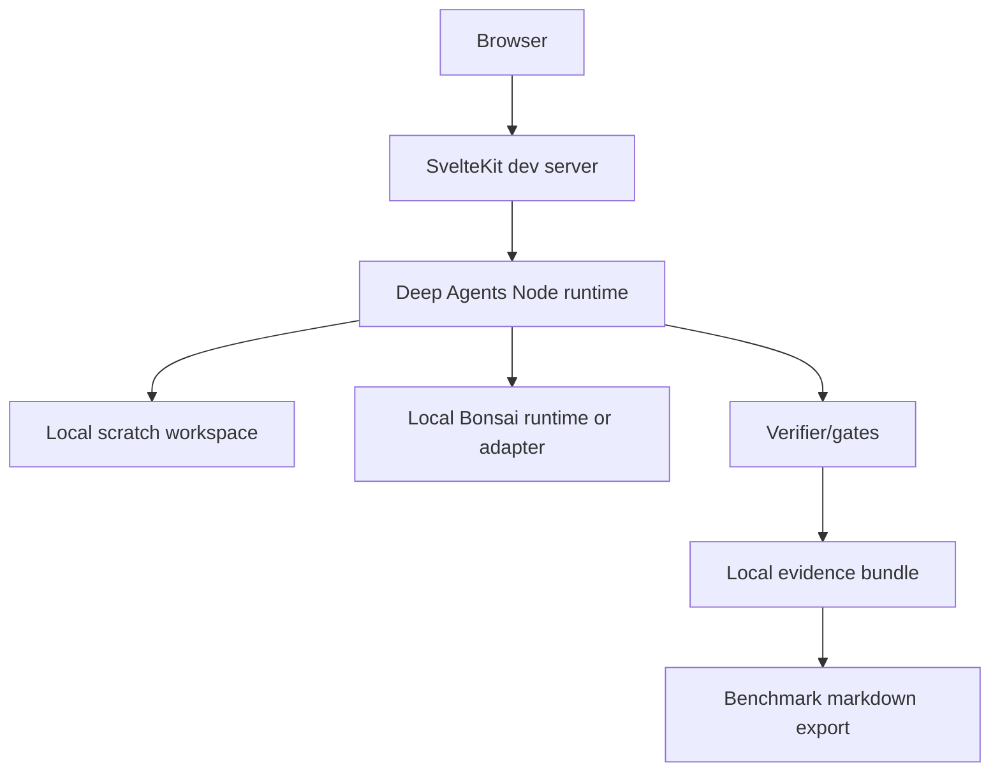

# Network Topology And Data Flows

## Local Development Topology



No public tunnel is required for the seed. External services are future optional
ports and must be approval-gated.

## Critical Flow 1: Build A Pack

```text
user workflow description
-> workflow interviewer
-> bounded requirements
-> pack drafter writes scratch files
-> eval designer writes synthetic cases
-> human approves diff
-> pack files move into workspace
```

## Critical Flow 2: Run Evidence

```text
pack files
-> validate pack
-> run synthetic evals
-> Bonsai adapter proposes/classifies
-> verifier rescans outbound clean record
-> evidence bundle stores trace, gate status, latency, limitations
```

## Critical Flow 3: Publish Or Contribute

```text
evidence bundle
-> claim critic
-> business-case memo
-> Prism benchmark report
-> human approves
-> GitHub branch/PR/export
```

## Data Classification

| Data | Allowed Location | Notes |
| --- | --- | --- |
| Real PHI | nowhere | rejected at input |
| Synthetic examples | draft state, evals, evidence | label as synthetic |
| Raw workflow answers | draft state only | do not persist as memory |
| Pack files | scratch, then repo after approval | code-free declarative artifacts |
| Gate results | evidence bundle | safe to publish when synthetic |
| Claims | draft then publish folder | must cite evidence |
| Secrets | never in agent tools | deny `.env` and sink credentials |

