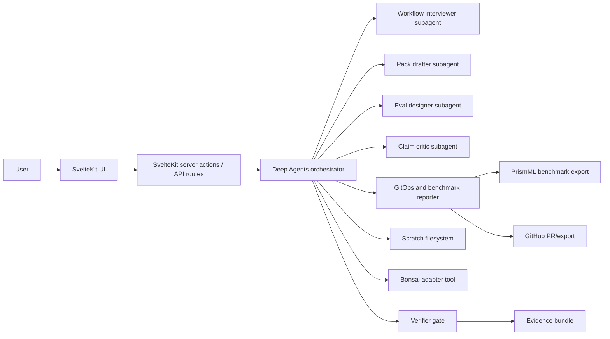

# System Architecture

## Components

### SvelteKit UI

Owns screen state, routing, progressive disclosure, and human approval surfaces.
It should use URL state for reviewable workflow state and Svelte local state for
panel/editor ergonomics.

### Deep Agents Orchestrator

Owns planning, task decomposition, scratch filesystem, subagent calls, and tool
coordination. It may draft files but may not write final pack artifacts without
approval.

### Bonsai Adapter Tool

Wraps Bonsai runtimes as bounded tools:

- propose recognizer candidates;
- classify synthetic spans;
- run benchmark samples;
- return structured output with limitations.

The adapter is not trusted as the verifier.

### Verifier Gate

Default-deny policy layer. It checks outbound payloads and generated claims against
policy. Future implementation should reuse the strongest parts of the prior scrubber
core where possible.

### Benchmark Exporter

Writes PR-ready reports that align with `PrismML-Eng/Bonsai-demo` community benchmark
templates. Reports must include hardware, runtime, model artifact, task, latency,
memory if available, pass/fail, verifier result, and limitations.

## Trust Boundaries

- Raw or sensitive examples never enter persistent memory.
- Generated pack files live in scratch until approved.
- External sinks are simulated by default.
- Benchmark exports use synthetic data only.
- Published copy must pass claim critic.

