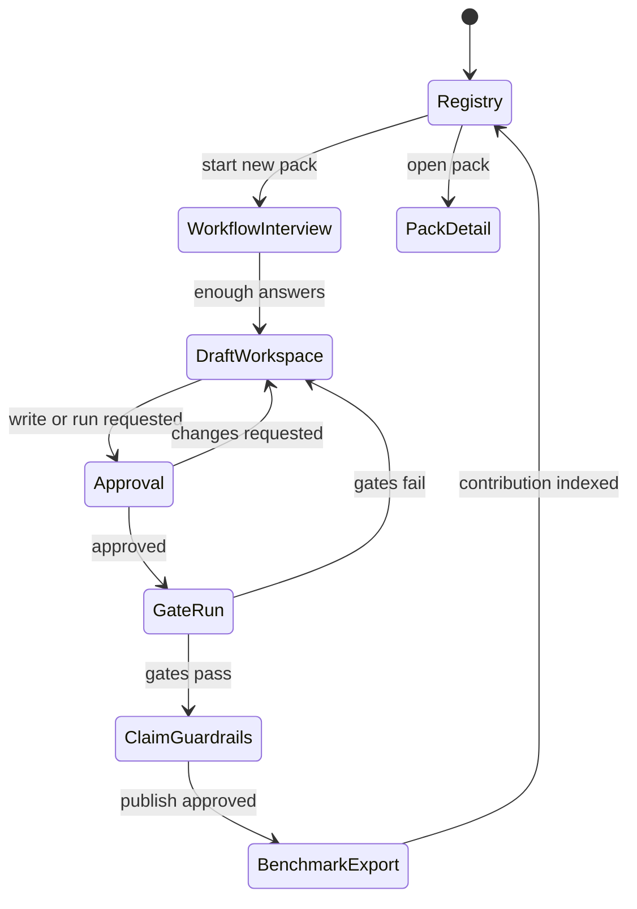

# Finite State Machine And Screen Map

The wireframes define five product zones. Each route is addressable so a user,
agent, or reviewer can share the exact state being discussed.

## Screens

| Route | Screen | Renders | Primary Components | Gates |
| --- | --- | --- | --- | --- |
| `/` | Pack registry | card grid, evidence table, pack detail/fork/PR panel | `RegistryFilters`, `PackCard`, `EvidenceTable`, `ContributionPanel` | examples synthetic; claims link to evidence |
| `/new?step=source` | Workflow interview | conversational interview, draft alongside, stepper | `AgentInterview`, `PackFileTree`, `StageStepper` | no real PHI; bounded questions |
| `/new?step=recognize` | Recognizer stage | proposed identifiers, model suggestions, manual edits | `RecognizerList`, `BonsaiProposalPanel` | Bonsai output is advisory |
| `/new?step=verify` | Policy stage | verifier settings, egress policy, risk tier | `PolicyEditor`, `RiskQuestionCard` | default-deny egress |
| `/new?step=structure` | Schema stage | clean record schema and sink preview | `SchemaEditor`, `SinkPreview` | sink sees clean payload only |
| `/new?step=publish` | Publish stage | README, business-case memo, claims | `PublishChecklist`, `ClaimMatrix` | evidence before claims |
| `/draft/:id` | Draft workspace | IDE split, generated files, todo list | `PackFileTree`, `AgentTodoList`, `FileEditor` | scratch writes first |
| `/approval/:id` | Human approval | full diff, risk ladder, approval card | `PackDiffViewer`, `RiskLadder`, `ApprovalCard` | HITL before writes/execute |
| `/claims/:id` | Claim guardrails | allowed/cannot-say, inline lint, critic | `ClaimEditor`, `ClaimCritic`, `EvidenceLinks` | no legal/compliance overclaim |
| `/runs/:id` | Run evidence | gate timeline, trace, latency, benchmark export | `GateTimeline`, `TraceViewer`, `BenchmarkExport` | failures visible |

## Wireframe Traceability

- Section 1 maps to workflow interview and draft workspace.
- Section 2 maps to human approval and risk ladder.
- Section 3 maps to registry, detail, fork, and PR.
- Section 4 maps to claim guardrails.
- Section 5 maps to CLI parity for `bonsai pack new`, approve write, gates, and eval
  evidence.

